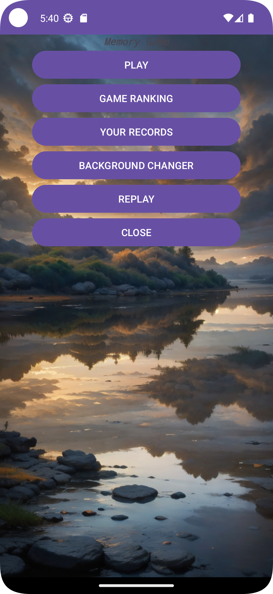
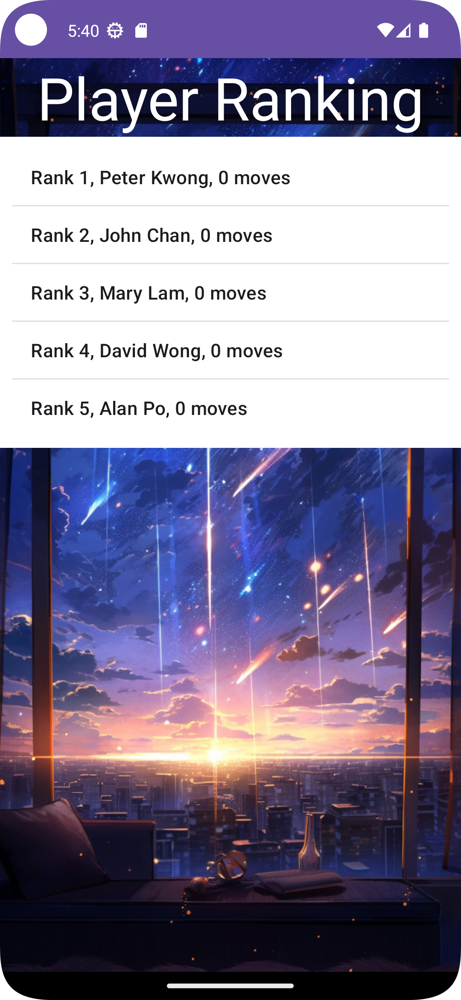
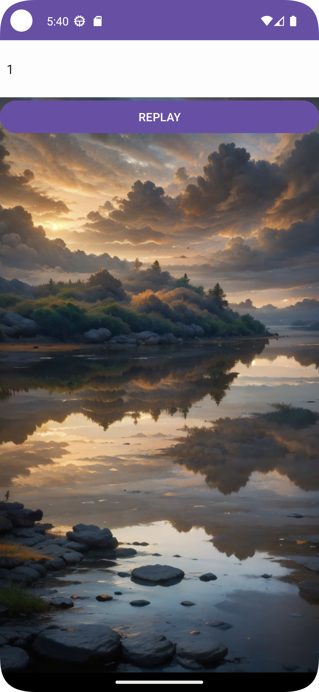

# ITP4501-Assignment
## Project Purpose

This Match Pairs Memory Game is developed as part of the ITP4501 Programming Techniques for Mobile Systems course. The main objective is to create an Android application that plays a Match Pairs Memory Game. The app records the results and move counts required to complete a game and displays history records using charts. This project aims to provide students with hands-on experience in mobile application UI and program design, practical skills in Android application development, and an understanding of the constraints and limitations of mobile applications.

## Features

- **Main Menu**: Includes options to Play, view Game Ranking, view Your Records, and Close the app.
- **Game Play**:
    - A 4x2 grid with 8 buttons, each randomly assigned a number from 1 to 4.
    - Players find matching pairs by touching the buttons.
    - Move count is displayed at the top of the screen.
    - A "Continue" button appears after all pairs are found to start a new game.
- **Game Ranking**: Downloads and displays a JSON ranking list from a server.
- **Your Records**: Loads and displays records from the local database.
- **Local Database**: Stores game logs with fields for gameID, playDate, playTime, and moves.

## Area of Improvement

One of the additional features intended for implementation was the game replay functionality. The goal was to replay recorded player's moves. However, challenges were encountered during the implementation, resulting in an unfinished game replay feature.

### Suggested Improvements for Game Replay

To successfully implement the game replay feature, the following approach may be taken:

1. **Use GridView**: Utilize a GridView to store individual image buttons representing the cards. This will allow for a more flexible and dynamic layout.

2. **Display Flipped Cards**: Implement a mechanism to display flipped cards by changing the visibility of the images. This can be achieved by toggling the visibility of the image buttons.

3. **Timing Control**: Introduce a delay to simulate the flipping of cards. Use a handler to sleep for 1 second before showing the next card. This will create a smooth and realistic replay experience.

4. **Replay Logic**: Develop a replay logic that iterates through the recorded moves and updates the GridView accordingly. Ensure that the sequence of moves is accurately reflected during the replay.

By following these steps, the game replay feature can be effectively implemented, enhancing the overall functionality and user experience of the application.
## Images

### Main Page

  

### In-Game

  

### Change Background

  

### Game Record

  

### Ranking

  

### Replay Record

  

### Select Replay Record

  

